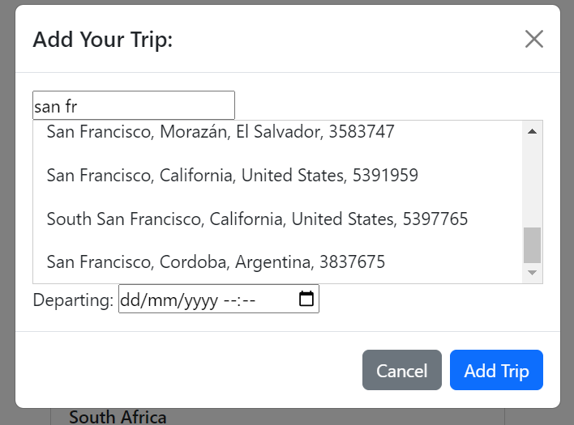
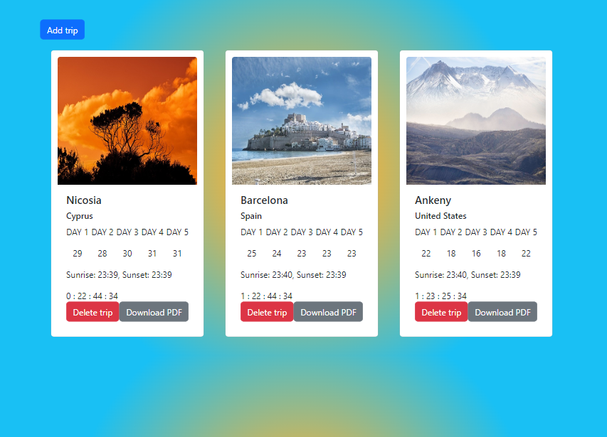

# The Travel Buddy Project
## Table of Contents
1. [Overview](#overview)
2. [Get started using v1.0](#get-started-using-v1.0)
3. [Dependencies](#dependencies)
4. [App Functionality](#app-functionality)


## Overview
 Travel Buddy was my capstone project for the Udacity Front-End Web Development Nanodegree. The application displays weather information for a user’s trip destination, along with a countdown timer and an image. It features a suggestive search bar that offers city suggestions as the user types and a date input field. Server responses are saved in local storage, ensuring data persists even when the user exits the app. This project involved dynamic DOM manipulation, creating routes to a backend server, integrating external APIs, and using Webpack for development and production builds.

## Get started using v1.0
Make sure you have NODE installed on your system because we will be running a local server. 
Download this repository and navigate to it using your terminal.

Run the following commands:
`npm i` to instal the dependencies needed to run the app.
Disclaimer: The production build does not work currently, therefore to demo the application I suggest just using the development build. 


Development build:

```
npm run server
```
In a separate terminial navigate to the travel buddy repo and run the following command.
```
npm start
```
Production build:
```
npm run build
npm run server
```


## Dependencies
This app was developed using HTML, CSS, Javascript and NodeJS. In addition,WebPack a code buddler, was used to create a development and production build of the application.

Axios = for making get request to third part APIs on the server
jspdf = for making a PDF with info about the trip
Bootstrap = to make it easier to style components

To see a full list of all the depedencies used in this project look at the  _package.json_ file.

## App Functionality
This app is a basic trip planner, where by users can enter the date they are departing to a certain  city/country and save it as a  trip with some additional information in local storage.

Once the user adds a trip they will be displayed a trip card. This card displays a photo of the coutry's flag, a count down that updates every second, and a five day weather forecast of the country the user input. The information about the trip is received by the client as a trip object and is then saved in local storage within an array of other trip the user may have added.

The location input field provides suggestions of cities as the user types for a given country or city. In essence it is a search bar that uses the geoname api to load the data needed.

The trip card has a functional delete button and doanload pdf button. 



